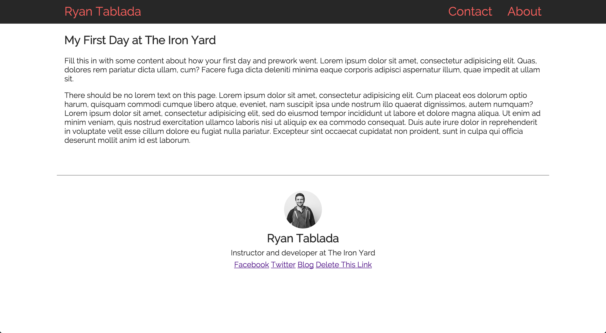

# html-intro-1

## Description

This assignment serves to reinforce comfort with:

* HTML
* CSS
* Keyboard shortcuts
* Working with our editors
* Basic Terminal Commands

## Objectives

- familiarize yourself with common HTML tags
- familiarize yourself with a lot of CSS properties
- familiarize yourself with navigating through the terminal, and opening projects with our code editor
- familiarize yourself with Chrome's Developer Tools and keyboard shortcuts
- familiarize yourself with the homework process

### Learning Objectives

After completing this assignment, you should be able to modify and work with existing CSS and HTML files.

### Performance Objectives

After completing this assignment, you should be able to effectively:

- navigate the folder structure in the terminal
- open workspaces and create files with Atom
- navigate through the assignments repository on Github
- create and use CSS selectors and HTML classes
- debug HTML and CSS with Chrome Developer Tools

## Details

### Deliverables

- a git repo containing:
    - `index.html` based on [./project/index.html](./index.html)
    - `styles` folder
        - `style.css` based on [./project/style.css](./style.css)
    - `images` folder
        - with any images you used with your design

### Requirements

- a working, HTML site
- a pull request with the Task list below
- a link to your pull request posted to online.theironyard.com on "Assignment 1"

### Normal Mode

Using the given `index.html` and `style.css` file, update the markup (classes and content), as well as the CSS to remove errors and complete a page that resembles the following image:



### Tasks

```
* [ ] Create new directory
* [ ] Initialize Git
* [ ] Create new repo using `hub create`
* [ ] Open project in your editor
* [ ] Copy contents of `index.html`
* [ ] Copy contents of `style.css`
* [ ] Commit this base set of files
* [ ] Push commit to github `git push -u origin master`
* [ ] Create a new `develop` branch
* [ ] Read existing HTML
* [ ] Read existing CSS files
* [ ] Open `index.html` in your browser
* [ ] Replace title with your name
* [ ] Commit change and push to github
* [ ] Create a new pull request with `hub pull-request -m "Turning in assignment"`
* [ ] Submit link to pull request to online.theironyard.com
* [ ] Fix broken or incomplete assets or links
* [ ] Fill in classes for elements to match styles
* [ ] Update broken CSS rules
* [ ] Look for invalid CSS or HTML that may be causing layout issues
* [ ] Read for other instructions
```

### Tasks for the Adventuresome

```
* [ ] Duplicate the `index.html` page to create pages for `contact.html` and `about.html`
* [ ] Link to `contact.html` and `about.html` from the navigation bar
* [ ] Update `style.css` to maintain design
* [ ] Create an about page to tell more about yourself (hobbies and such)
* [ ] Create a contact form (it will not submit) with fields for Name, Email, and a comment box
```
