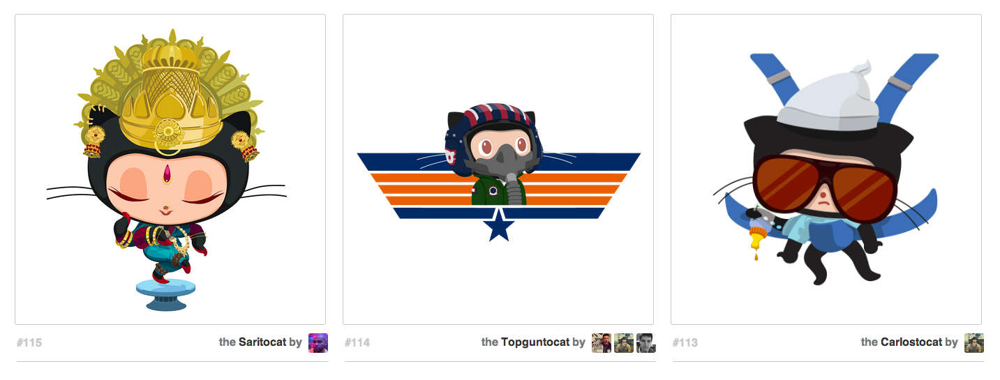

# Box Model and Floats

## Description

Grouping HTML elements and working with layouts in CSS are two of the most important skills to learn.
This exercise tests both of these skills.

### Learning Objectives

After completing this assignment, you should...

* Understand HTML/CSS Layout
* Be able to place any element on a page where you want it.


### Performance Objectives

After completing this assignment, you be able to effectively use

* `div`s and other "div-like" elements to group HTML for layout and semantics
* Use CSS Floats
* Turn in Homework Assignments
  - Create Git Repo
  - Create pull request

## Details

### Deliverables

* A repo containing at least:
  * `styles/app.css`
  * `index.html`

## Normal Mode
Normal Mode description

* Create HTML without styling to group HTML to match the content shown [below](./octodex.png)
* Using HTML and CSS to make the layout [below](./octodex.png)



### Tasks

```
* [ ] Create a new directory called `03-box-model`
* [ ] Use the `git` cli to initialize a new project
* [ ] Checkpoint: Created and committed `index.html` and `app.css` boilerplate
* [ ] Use the `hub create` `03-box-model`
* [ ] Use the `git` cli to create a branch called `develop`
* [ ] Checkpoint: Link CSS to HTML page
* [ ] Use `hub pull-request` to create a new pull request
* [ ] Post link to pull request on online.theironyard.com
  * [ ] Checkpoint: Create markup to represent one grid item
    * [ ] Markup: Image
    * [ ] Markup: Number
    * [ ] Markup: Octocat name
    * [ ] Markup: Avatar(s)
  * [ ] Checkpoint: Duplicate markup from the last step and group with a div
  * [ ] Complete: Pushed `index.html`
* [ ] Add styles for page
  * [ ] Checkpoint: Create a "three up" grid
  * [ ] Checkpoint: Size images to layout within grid
  * [ ] Checkpoint: Style Number
  * [ ] Checkpoint: Style Octocat Name
  * [ ] Checkpoint: Style Avatar
  * [ ] Checkpoint: Style Image Arrow
  * [ ] Checkpoint: Cleanup Styles
  * [ ] Complete: Pushed changes
```

## Additional Resources

- [Learn CSS Layout](http://learnlayout.com/)

### Images

* https://octodex.github.com/images/filmtocat.png
* https://octodex.github.com/images/privateinvestocat.jpg
* https://octodex.github.com/images/gracehoppertocat.jpg

More images at https://octodex.github.com/ right click and select "Copy Image URL"

For the avatar images use http://lorempixel.com/100/100
