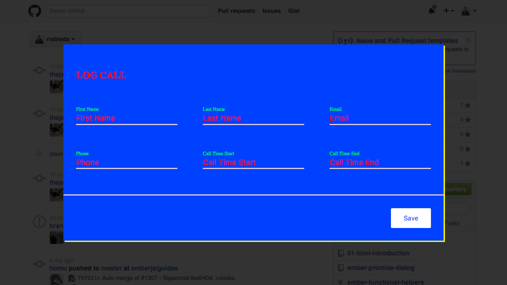
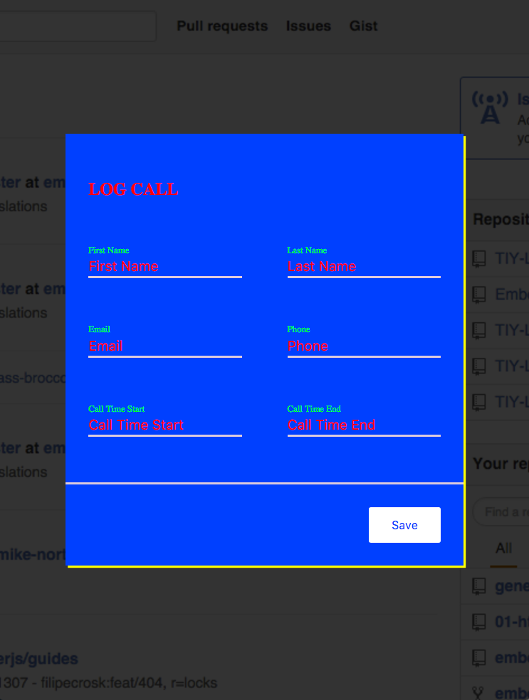
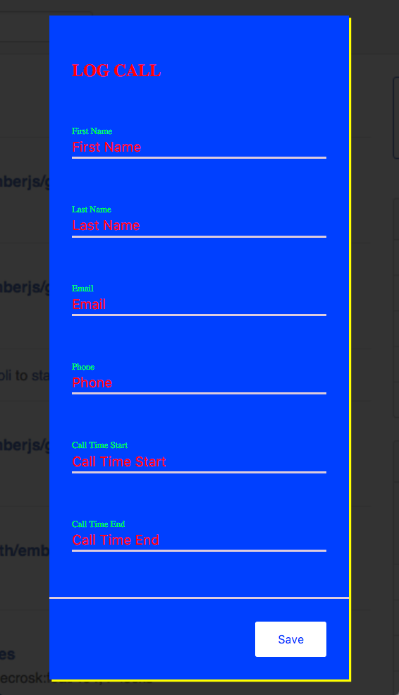
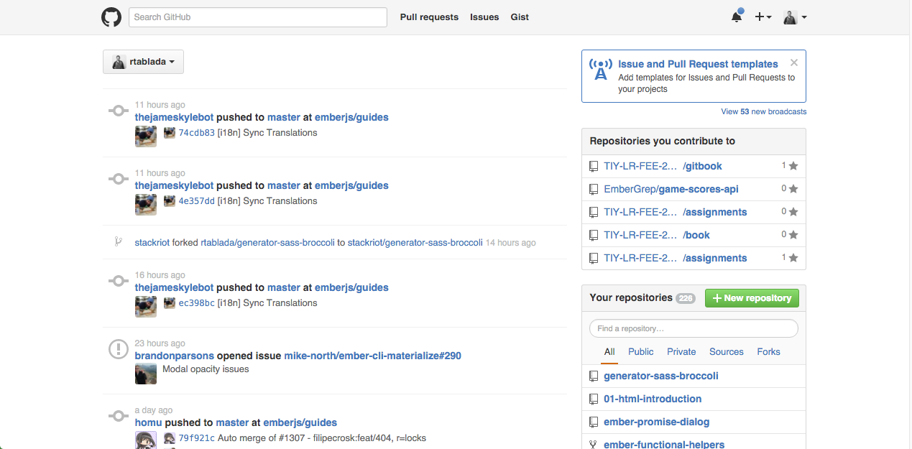

# Form Modals

## Description

Now that you have a grasp of layout and positioning, it's now time to focus on organizing your CSS.
For this assignment, use the SASS project skeleton to create a given layout.
This assignment will also

## Objectives

### Learning Objectives

After completing this assignment, you should be able to:

* Use SASS variables
* Use SASS `@import` statements
* Lint SASS and follow linting errors

### Performance Objectives

After completing this assignment, you should be able to effectively use:

* Create semantic HTML for a layout
* Use flex-box to center content
* Use flex-box to stack content
* Use `flex-grow` and `min-width` to make a responsive
* Organize SASS using variables
* Organize SASS using `@import` statements
* Create SASS code free of linting errors

## Details

### Deliverables

* A repo started with the [SASS Boilerplate](https://github.com/rtablada/generator-sass-broccoli).

### Requirements

Recreate the following design using HTML and SASS.

#### Desktop



#### Tablet



#### Phone



>You should replicate the design as closely as possible (don't take creative liberties with this one).

> You should make sizes and colors configurable with SASS variables

The designer has given you a few things to work with:

* Gutter Size: `2rem`
* Input Minimum Width: `10rem`
* Background Haze: `rgba(0, 0, 0, 0.8)`
* Button Background (Brand Primary): `#fff`
* Card Background: `#0040ff`
* Card Text Color: `#f00`
* Label Color: `#0f0`
* Brand Border: `0.2rem solid #dcd`
* Brand Shadow: `0.2rem 0.2rem #ff0`

This modal should be all wrapped up in a `.modal-container` div with the background haze set as its background.
Also use `position: fixed` to make this `.modal-container` appear above all other elements on the page.

Another person from your company will be creating the markup for the app behind your modal.
For now, you can simulate the rest of the app by setting the following styles on `body`:

```css
body {
  background: url('img/bg.png') no-repeat top center fixed;
  background-size: cover;
}
```

And the `bg.png` is the image below:



## Tasks

```
* [ ] Create a new project using the `yo sass-broccoli` command
* [ ] Follow the homework checklist to create and start project (the boilerplate has already been created for you with the generator).
* [ ] **GOAL**: Create markup for Modal Form
  - [ ] Markup: Modal Overlay
  - [ ] Markup: Card
  - [ ] Markup: Card Title
  - [ ] Markup: Card Fields
    * [ ] Markup: Form Field Label
    * [ ] Markup: Form Field Input
  - [ ] Markup: Card Actions
    * [ ] Markup: Form Button
* [ ] **GOAL**: Organize Designer Assets
  - [ ] Save Background Image to `public/img/bg.png`
  - [ ] Create `styles/_variables.scss` file
  - [ ] Import `variables` with SASS
  - [ ] Create variables for the designer brand specifications
  - [ ] Create `styles/_base.scss`
  - [ ] Import `base` with SASS
  - [ ] Style Base Styles
    * [ ] Unset body margins
    * [ ] Set body background
    * [ ] Set `outline: none` on `input` tags
* [ ] **GOAL**: Style Modal (non-responsive)
  - [ ] Style: Modal Overlay
  - [ ] Style: Card
  - [ ] Style: Card Title
  - [ ] Style: Card Fields
    * [ ] Style: Form Field Label
    * [ ] Style: Form Field Input
  - [ ] Style: Card Actions
    * [ ] Style: Form Button
* [ ] **GOAL**: Style Fields Responsive
  - [ ] Style: Field `min-width`
  - [ ] Style: Field `flex-grow`
```

* Todos Gist for following along: https://gist.github.com/rtablada/2b66f5df8868834dba9d

## Additional Resources

* Read [Learn Layout](http://learnlayout.com/)
* Read [HTML tag content categories](https://developer.mozilla.org/en-US/docs/Web/Guide/HTML/Content_categories)
