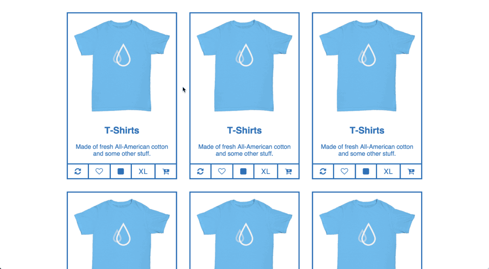
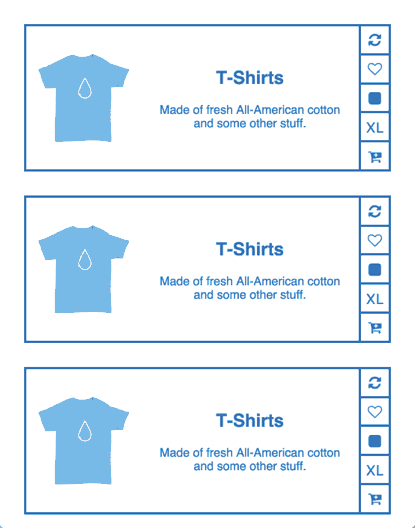

# TShirts

## Description

Working with user state and varying display sizes is a common occurrence when working with CSS.
Usually responsive designs are simple breakdowns in grid size.
Other times, the design changes more drastically to make the UI easier to use.

## Objectives

### Learning Objectives

After completing this assignment, you should be able to:

* Use Pseudo Selectors (`:first-of-type`, `:last-of-type`, `:hover`, etc.) to style elements
* Use Media Queries

### Performance Objectives

After completing this assignment, you should be able to effectively use:

* Use flex-box to create a grid with gutters
* Use flex-box to stack content
* Use `flex-grow` and `min-width` to make a responsive grid
* Organize SASS using variables
* Organize SASS using `@import` statements
* Create SASS code free of linting errors
* Use Pseudo Selectors in CSS/SCSS
* Use Media Queries in CSS/SCSS
* Use `position: relative` and `position: absolute` to create tool tips

## Details

### Deliverables

* A repo forked from [`TIY-TN-FEE-2016-spring/06-tshirts`](https://github.com/TIY-TN-FEE-2016-spring/06-tshirts)

### Requirements

Recreate the following design using HTML and SASS.

#### Desktop



#### Tablet



>You should replicate the design as closely as possible (don't take creative liberties with this one).

> You should make sizes and colors configurable with SASS variables

The designer has given you a few things to work with:

*


## Tasks

```
* [ ] Fork `TIY-TN-FEE-2016-spring/06-tshirts`
* [ ] Run `hub clone 06-tshirts` to clone your forked repo locally
* [ ] Change directory into the newly created `06-tshirts` directory
* [ ] Create a `develop` branch
* [ ] Run `npm install` to install local dependancies for build tools
* [ ] **GOAL**: Style Grid Basics
  * [ ] Outer container gutter padding
  * [ ] Inner container max width
  * [ ] Stack Grid Items Horizontally
* [ ] **GOAL**: Style Shop Item
  - [ ] Style: Border around Shop Item
  - [ ] Style: Image Gutter
  - [ ] Style: Button Row
  - [ ] Style: Button Border
  - [ ] Style: Drop Down Position
  - [ ] Style: Drop Down Stack
  - [ ] Style: Drop Down Item Border
  - [ ] Style: Button Hover State
  - [ ] Style: Dropdown Hover State
* [ ] **GOAL**: Style Color Icons
  - [ ] Style: Pink Box
  - [ ] Style: Blue Box
  - [ ] Style: Yellow Box
  - [ ] Style: Green Box
* [ ] **GOAL**: Grid Settings Phone
  - [ ] Style: Grid Wrap
  - [ ] Style: Grid Min Width
* [ ] **GOAL**: Tablet Layout
  - [ ] Style: Full Width
  - [ ] Style: Shop Item Changes
  - [ ] Style: Buttons
  - [ ] Style: Dropdown Position
  - [ ] Style: Dropdown Changes
```

* Todos Gist for following along:
