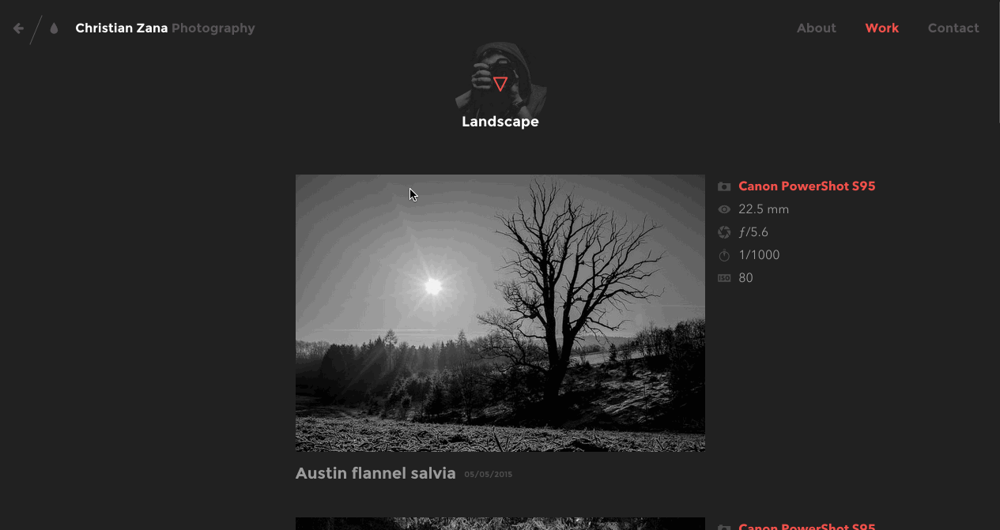
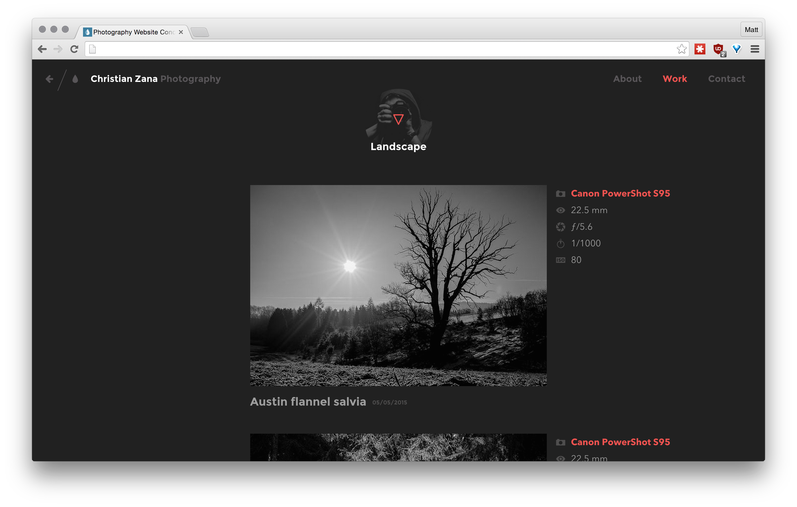
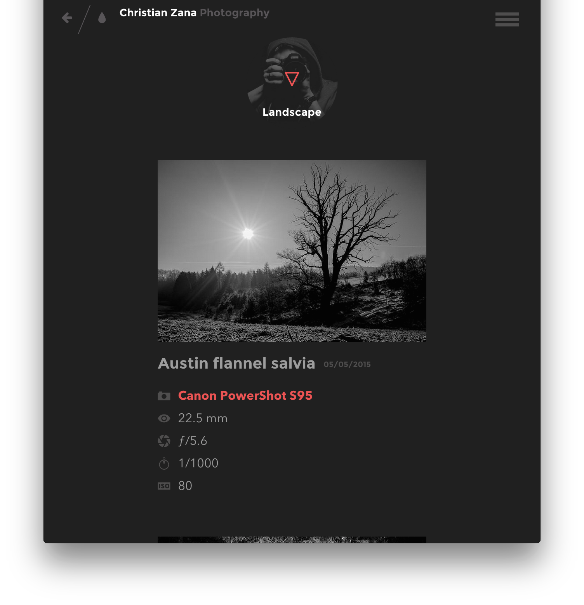

# Photo Site

## Description

Now it's time to put what you've learned about HTML, CSS, SASS, and build tools into practice.

## Objectives

### Learning Objectives

After completing this assignment, you should be able to:

* Add libraries to your build process using NPM and Broccoli
* Use SASS `@includes` and `@extends` for organization and limiting reuse

### Performance Objectives

After completing this assignment, you should be able to effectively use:

* Use flex-box to create a grid with gutters
* Use flex-box to stack content
* Use `flex-grow` and `min-width` to make a responsive grid
* Organize SASS using variables
* Organize SASS using `@import` statements
* Create SASS code free of linting errors
* Use Pseudo Selectors in CSS/SCSS
* Use Media Queries in CSS/SCSS
* Use `position: relative` and `position: absolute` to create tool tips
* Use SASS `@includes` and `@extends` for organization and limiting reuse
* Use Font Awesome Icons
* Use CSSGram `@extends`

## Details

### Deliverables

* A project built using the `sass-broccoli` Yeoman Generator

### Requirements

Recreate the following design using HTML and SASS.

#### Full Site



#### Desktop



#### Phone



The designer has given you a few things to work with:

* Brand Dark Gray: `#212121`
* Brand White: `#f4f4f4`
* Brand Light Gray: `#585558`
* Brand Red: `#EF5350`


* Gutter: `2rem`;
* Max Content Width: `60rem`


## Tasks

```
* [ ] Generate new `sass-broccoli` project
* [ ] Initialize Git Repo
* [ ] Create Github Repository
* [ ] Commit generated code to `master` branch
* [ ] Push `master` branch
* [ ] Create `develop` branch
* [ ] Install `cssgram` with `npm` and remember the `--save` flag to update `package.json`
* [ ] Add `'node_modules/cssgram/source/scss',` to `stylePaths` in `Brocfile.js`
* [ ] Commit changes to `develop` branch
* [ ] Push `develop` branch
* [ ] Create a pull request
* [ ] Link Pull Request in TIYO
```

* Todos Gist for following along:
