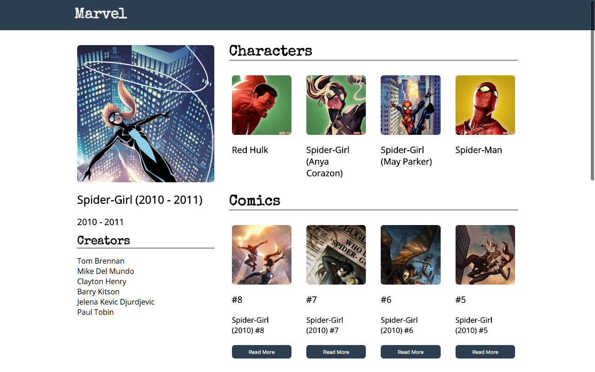
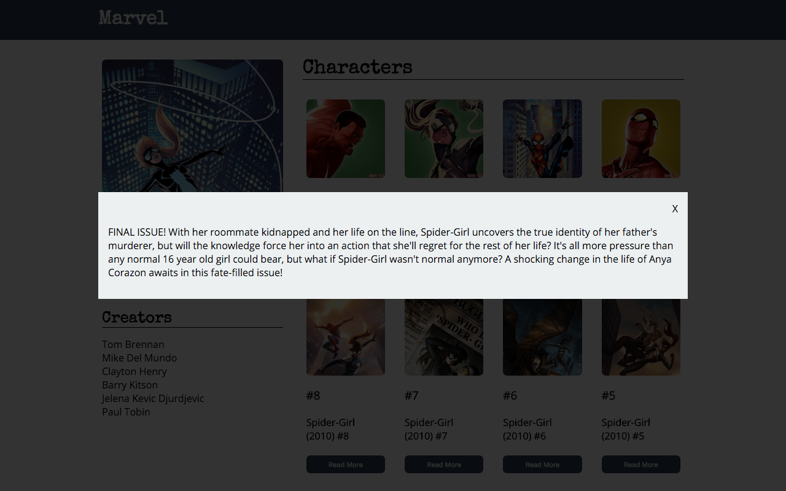

# Marvel Series Profile

## Description

It's time to get serious about HTML, CSS, and Javascript.
For this assignment you will be creating a profile page for a Marvel Comic Series.

## Objectives

### Learning Objectives

After completing this assignment, you should be able to:

* Export ES2015 modules
* Use ES2015 classes to group behavior
* Listen for events using `.addEventListener`
* Add classes to HTML to represent application state
* Use `fetch` to make requests to an API

### Performance Objectives

After completing this assignment, you should be able to effectively use:

* Decide steps to take based on failing tests
* Export ES2015 modules
* Use ES2015 classes to group behavior
* Listen for events using `.addEventListener`
* Add classes to HTML to represent application state
* Use `fetch` to make requests to an API
* Style using SCSS

## Details

### Deliverables

* A project created using the Yeoman Qunit Broccoli Generator `yo qunit-broccoli`

Retrieve information for a comic series using the [Marvel API](developer.marvel.com) for the series, it's characters, and it's comics.

Using the fetched information recreate the following design:



When a user clicks on the "Read More" button pop up a model (using similar `position: fixed` as the modal assignment) showing the description of a comic.



The modal should go away when the "X" is clicked

### Requirements

Write a classes for:

* `SeriesInfoView` - fills in the HTML for the sidebar given a set of data from
* `CharacterView` - fills in the HTML for a single character
* `CharacterListView` - creates `CharacterView`s for each character result
* `ComicView` - fills in the HTML for a single character and deals with the `active` class for the modal
* `ComicListView` - creates `ComicView`s for each character result

## Resources

* Perfectly Square images without stretching: http://www.mademyday.de/css-height-equals-width-with-pure-css.html

## Tasks

```
* [ ] Create a new project named "13 Marvel Profile" using the `yo qunit-broccoli` command
* [ ] Run `hub create` to create a new repository on Github
* [ ] Push `master` branch
* [ ] Create `develop` branch
* [ ] Create an API Key on http://developer.marvel.com/documentation/getting_started
* [ ] Add `localhost` to your authorized referrers on https://developer.marvel.com/account
* [ ] Explore the interactive documentation for the [Series Details](http://developer.marvel.com/docs#!/public/getSeriesIndividual_get_26) Try series id `9856` for Spider Girl
* [ ] Create HTML in `index.html` for styling and layout (this will be replaced by JS content SOON!)
	- [ ] Top Nav
	- [ ] Series Details Sidebar
	- [ ] Characters
	- [ ] Comics
	- [ ] Modal
```

* Todos Gist for following along: https://gist.github.com/rtablada/e7a0f4e597ad00666dd4
