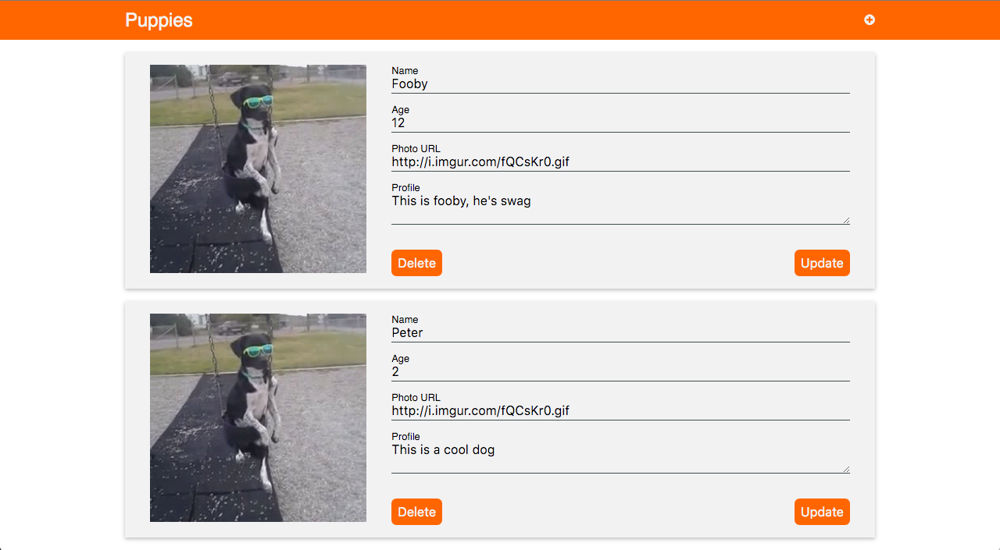
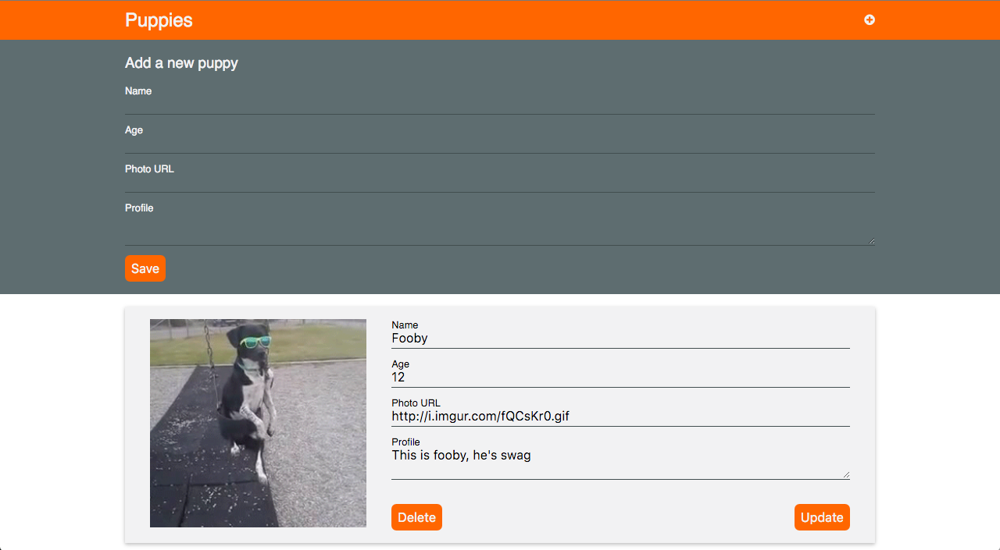

# Puppy Adoption Site

## Description

Now that you've practiced getting data from a server, it's time for you (and your users) to add their information to the equation.

## Objectives

### Learning Objectives

After completing this assignment, you should be able to:

* GET, POST, PUT, and DELETE data using `fetch`
* Create Collection and Item Views
* Create Application Views
* Create Form Views

### Performance Objectives

After completing this assignment, you should be able to effectively use:

* Decide steps to take based on failing tests
* Export ES2015 modules
* Use ES2015 classes to group behavior
* Listen for events using `.addEventListener`
* Add classes to HTML to represent application state
* GET, POST, PUT, and DELETE data using `fetch`
* Create Collection and Item Views
* Create Application Views
* Create Form Views
* Style using SCSS

## Details

### Deliverables

* A project created using the Yeoman Qunit Broccoli Generator `yo qunit-broccoli`

Create a site that talks to `http://tiny-tn.herokuapp.com/collections/<initials>-puppies` (for instance my collection URL would be `http://tiny-tn.herokuapp.com/collections/rt-puppies`).
Use this server collection to recreate the following site:





<iframe src="https://player.vimeo.com/video/160633770" width="500" height="375" frameborder="0" webkitallowfullscreen mozallowfullscreen allowfullscreen></iframe>

### Requirements

Write a classes for:

* `ApplicationView` - Gets data an manages what data is loaded and when to re-render collection views and starts other views (creates `PuppyView` for each puppy in the data)
* `PuppyView` - Fills in the HTML for a single puppy, captures events for destroying events and updating puppies
* `CreateFormView` - Toggles top navigation form, captures save for creating a new puppy

## Tasks

```
* [ ] Create a new project named "14 Puppy Adoption" using the `yo qunit-broccoli` command
* [ ] Run `hub create` to create a new repository on Github
* [ ] Push `master` branch
* [ ] Create `develop` branch
* [ ] Create HTML in `index.html` for styling and layout (this will be replaced by JS content SOON!)
	- [ ] Top Nav
	- [ ] Top Nav Form
		* [ ] Name
		* [ ] Age
		* [ ] Profile URL
		* [ ] Profile
	- [ ] Puppy Card
		* [ ] Puppy Image
		* [ ] Puppy Form
			- [ ] Name
			- [ ] Age
			- [ ] Profile URL
			- [ ] Profile
* [ ] Create `index` module that exports a function to kick things off
* [ ] Create `application` module that exports an `ApplicationView` class
	- [ ] Declare `render` method that:
		* [ ] Clears the puppy list HTML
		* [ ] Creates `PuppyView`s for every item in `data`
		* [ ] Appends `PuppyView` element to the puppy list
	- [ ] Declare a contstructor that:
		* [ ] Makes `fetch` request to `tiny-tn` and set view data when request is complete and calls `render`
		* [ ] Creates and attaches a new `CreateFormView` to the top navigation
* [ ] Create `puppy-view` module that exports a `PuppyView` class
	- [ ] Declare a contstructor that:
		* [ ] Accepts arguments for the current puppy and the application instance
		* [ ] Creates an element to represent a single puppy object
		* [ ] Creates empty DOM for a single puppy card
		* [ ] Calls `render`
		* [ ] Listens for `sumbit` events on the edit form and that:
			- [ ] Looks up the current values for form inputs
			- [ ] Makes a `fetch` `PUT` request to update current puppy with the server
			- [ ] Use `Object.assign` to copy values from fetch response on to the data object.
			- [ ] Call `render` so that profile picture is updated
		* [ ] Listens for `click` event on "X" to:
			- [ ] Make a `fetch` `DELETE` request to destroy the current puppy from the server
			- [ ] Call `remove` on the `application` to stop showing the element to the user and remove from the local data set
```

* Todos Gist for following along:
