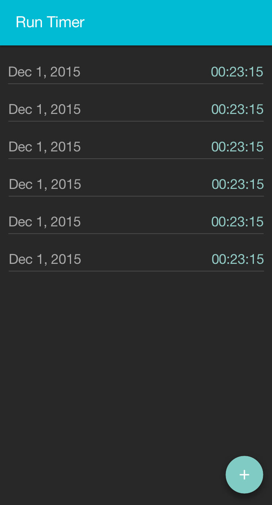
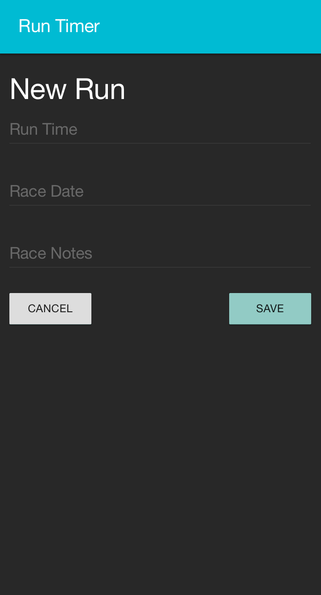
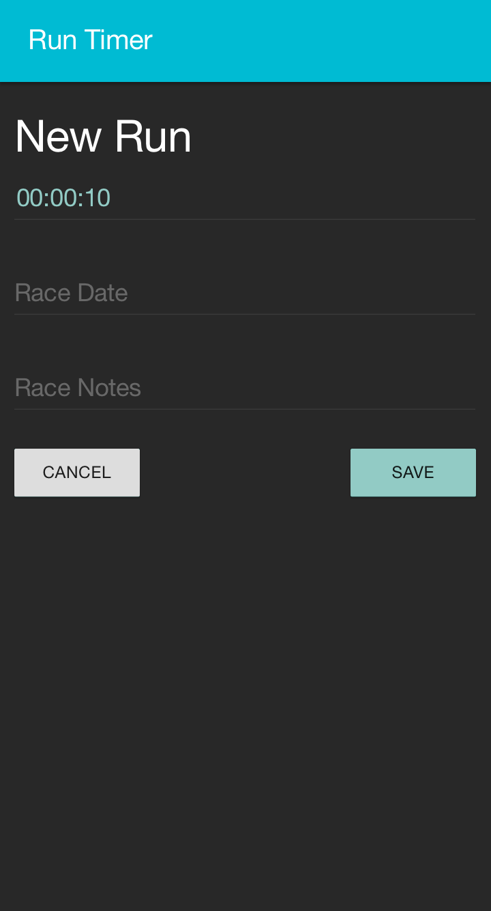
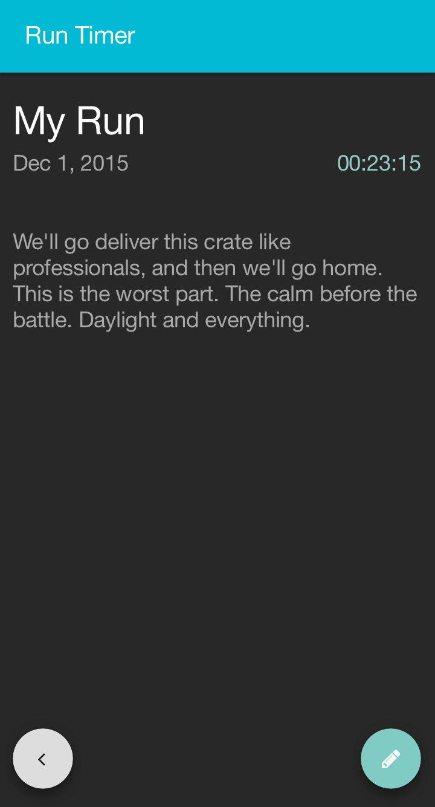

# Run Timer

## Description

Ember Routes, Templates, and Controllers, make a routed version of the following app.
Your designer has given you a clickable prototype as well as mockups for the new run timer they want to build.
Also applying styling and best practices using BEM class naming and SASS.

## Objectives

### Learning Objectives

After completing this assignment, you should be able to:

* Create Ember CLI Projects
* Run Ember CLI Development Server `ember serve`
* Use Handlebars Application Template in Ember
* Create and use Route `model` hooks to load data
* Use controllers to manage data AFTER it has been loaded
* Use Ember Routes with Dynamic segments to load data for single resources from the server
* Use the `link-to` Handlebars component and the `transitionToRoute` method in controllers to navigate around your app

### Performance Objectives

After completing this assignment, you should be able to effectively use:

* Export ES2015 modules
* Use BEM class names and nested selectors for styling
* Use `fetch` to make requests to an API
* Create Ember CLI Projects
* Run Ember CLI Development Server `ember serve`
* Use Handlebars Application Template in Ember
* Create and use Route `model` hooks to load data
* Use controllers to manage data AFTER it has been loaded
* Use Ember Routes with Dynamic segments to load data for single resources from the server
* Use the `link-to` Handlebars component and the `transitionToRoute` method in controllers to navigate around your app

## Details

### Deliverables

* A project created using Ember CLI
* A project with no ESLint Errors

### Requirements

Recreate the following app based on the following screenshots and clickable prototype.

This app should use the [tiny-tn server](http://tiny-tn.herokuapp.com) or a similar API to persist runs over time.
If using the tiny-tn server name your collection like:

```
http://tiny-tn.herokuapp.com/collections/runs-<your initials>
```

Each run has the following data attributes:

* `runTime`
* `raceDate`
* `notes`

### [Clickable Prototype](https://invis.io/3U50MD2TC)

* https://invis.io/3U50MD2TC

### Index Page

This page lists all existing runs



### New Run

Each run should have a run time (HH:MM:SS), Race Date (you can use a `type="date"` input), Race Notes (allowing notes for how the race went).

> The second screenshot shows input into one of the fields.




### Run Details

This shows the date, time, and notes for a single run.



> **NOTE** These screens do not show an edit view, but your app should have an edit screen similar to the "New Run" screen

## Description

By the end of this application you should be able to see all runs, create new runs, see the details for a run, and edit runs.

> **NOTE** This app doesn't allow you to delete runs

## Brand/Design Resources

> You should store these as SASS variables for use around your app styles.

### Colors

* Button Grey - #ddd
* Button Green - #80cbc4
* Header Bar Blue - #00bbd3
* Title White - #fff
* Regular Text - rgba(255, 255, 255, 0.6)
* Placeholder Text - rgba(255, 255, 255, 0.4)
* Green Text - #92cbc5
* Button Text Grey - #1c1c1c

### Typography

* Font Family - Roboto
* Icon Font - Font Awesome
* Base Font Size - 16px
* Base Line Height - 24px

## Tasks

```md
* [ ] Checkpoint: Start new project
  - [ ] Create a new project named `run-timer-16` using Ember CLI
  - [ ] Run `hub create` to create a new repository on Github
  - [ ] Push `master` branch
  - [ ] Create `develop` branch
  - [ ] Run `curl -L http://bit.ly/ember-tiy-starter | bash` to install linting and SASS
  - [ ] Commit initial commit
  - [ ] Push `develop` branch
  - [ ] Create pull request
* [ ] Shared UI
  - [ ] Checkpoint: Update Application template
    * [ ] Markup: Nav Bar
    * [ ] Markup: App Container
    * [ ] Complete: Commit & Push
  - [ ] Checkpoint: Style Shared UI
    * [ ] Style: Base Styles
    * [ ] Style: Nav Bar
    * [ ] Complete: Commit & Push
* [ ] Show list of runs on `index` route
  - [ ] Generate Route and template using Ember CLI
  - [ ] Fetch data for your run collection `http://tiny-tn.herokuapp.com/collections/runs-<your initials>`
* [ ] New Run Page
  - [ ] Checkpoint: Get started
    * [ ] Generate route to respond to the url `new` using Ember CLI
    * [ ] Add a link to the `new` route from the `index` template to allow navigation
  - [ ] Checkpoint: Create the Markup For The New Run in `new` template
    * [ ] Markup: Form
    * [ ] Markup: Inputs
    * [ ] Markup: Buttons
    * [ ] Complete: Commit & Push
  - [ ] Checkpoint: Style New Run Page
    * [ ] Style: Form
    * [ ] Style: Inputs
    * [ ] Style: Buttons
    * [ ] Complete: Commit & Push
  - [ ] Checkpoint: Listen for form submit
    * [ ] Add action helper to listen for `submit` event
    * [ ] Use `fetch` to POST new run data from the form
      - [ ] After save, redirect to run list
    * [ ] Check that newly saved run
    * [ ] Complete: Commit & Push
* [ ] All Runs List
  - [ ] Checkpoint: `index` Template
    * [ ] Markup: List of Runs
    * [ ] Markup: New Run Button (should link to `new` page)
    * [ ] Complete: Commit & Push
  - [ ] Checkpoint: Style Index Page
    * [ ] Style: List of Runs
    * [ ] Style: New Run Button
    * [ ] Complete: Commit & Push
* [ ] Run Detail Page
  - [ ] Checkpoint: Get started
    * [ ] Generate route for run detail page
    * [ ] Update custom `path` for detail route to take in a dynamic `_id`
    * [ ] Make list item in `index` template link to the detail based on a run's `_id` property
    * [ ] Complete: Commit & Push
  - [ ] Checkpoint: Markup for run details page
    * [ ] Markup: Title
    * [ ] Markup: Date
    * [ ] Markup: Time
    * [ ] Markup: Notes
    * [ ] Complete: Commit & Push
  - [ ] Checkpoint: Style run details page
    * [ ] Style: Title
    * [ ] Style: Date
    * [ ] Style: Time
    * [ ] Style: Notes
    * [ ] Complete: Commit & Push
* [ ] Run Edit Page
  - [ ] Checkpoint: Get started
    * [ ] Generate route for run detail page
    * [ ] Update custom `path` for detail route to take in a dynamic `_id` and then `/edit`
    * [ ] Make edit link using Font Awesome from the run detail page to the new edit page
    * [ ] Complete: Commit & Push
  - [ ] Checkpoint: Markup for run edit page
    * [ ] Markup: Form
    * [ ] Markup: Inputs
    * [ ] Markup: Buttons
    * [ ] Complete: Commit & Push
  - [ ] Checkpoint: Style New Run Page
    * [ ] Style: Form
    * [ ] Style: Inputs
    * [ ] Style: Buttons
    * [ ] Complete: Commit & Push
  - [ ] Checkpoint: Listen for form submit
    * [ ] Add action helper to listen for `submit` event
    * [ ] Use `fetch` to PUT updated values from form
      - [ ] After save, redirect to run detail page for updated run
    * [ ] Complete: Commit & Push
```

Todo list gist rendered: https://gist.github.com/rtablada/ebd6bd9d61eaee4c12729c340550cfc0
