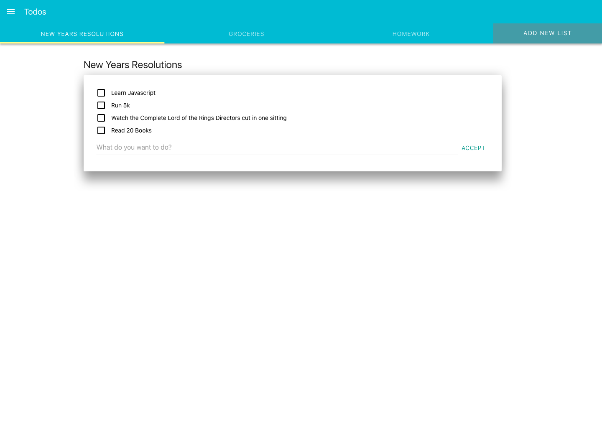

# Todo App

## Description

Your new start up is going to change the world of todo list apps!

## Objectives

### Learning Objectives

After completing this assignment, you should be able to:

* Manage Data using Ember Data
* Manage Related Data using Ember Data Relationships
* Use nested routes to organize Ember applications
* Use nested routes with the `outlet` helper to show different screens to the user
* Create JSON APIs using Candycane.js
* Deploy Candycane.js Servers using Heroku

### Performance Objectives

After completing this assignment, you should be able to effectively use:

* Export ES2015 modules
* Use BEM class names and nested selectors for styling
* Create Ember CLI Projects
* Run Ember CLI Development Server `ember serve`
* Use Handlebars Application Template in Ember
* Create and use Route `model` hooks to load data
* Use controllers to manage data AFTER it has been loaded
* Use Ember Routes with Dynamic segments to load data for single resources from the server
* Use the `link-to` Handlebars component and the `transitionToRoute` method in controllers to navigate around your app
* Manage Data using Ember Data
* Manage Related Data using Ember Data Relationships
* Use nested routes to organize Ember applications
* Use nested routes with the `outlet` helper to show different screens to the user
* Create JSON APIs using Candycane.js

## Details

### Deliverables

* A project created using Ember CLI
* A project with no ESLint Errors

### Requirements

Recreate the following app based on the following screenshots.

This app should use an API created with Candycane.js (more on that tomorrow).
Until then use `http://my-todo-list-api.herokuapp.com`

## Description

By the end of this application you should be able to manage lists, add todo-items to the list, and mark items as complete.




## Brand/Design Resources

> You should store these as SASS variables for use around your app styles.

### Colors

* Brand Blue - #00bbd3
* Brand Yellow - #ffff8c
* Title White - #fff
* Regular Text - #1c1c1c
* Placeholder Text - rgba(0, 0, 0, 0.38)

### Typography

* Font Family - Roboto
* Base Font Size - 14px
* Base Line Height - 2.14rem

## Tasks

```md
* [ ] Checkpoint: Start new project
  - [ ] Create a new project named `todo-app-18` using Ember CLI
  - [ ] Run `hub create` to create a new repository on Github
  - [ ] Push `master` branch
  - [ ] Create `develop` branch
  - [ ] Run `curl -L http://bit.ly/ember-tiy-starter | bash` to install linting and SASS
  - [ ] Run `ember install ember-yoga-sass` to install Yoga SASS (faster grid systems)
  - [ ] Commit changes
  - [ ] Push `develop` branch
  - [ ] Create pull request
* [ ] Shared UI
  - [ ] Checkpoint: Update Application template
    * [ ] Markup: Nav Bar
    * [ ] Markup: App Container
    * [ ] Complete: Commit & Push
  - [ ] Checkpoint: Style Shared UI
    * [ ] Style: Base Styles
    * [ ] Style: Nav Bar
    * [ ] Complete: Commit & Push
* [ ] Show list of todo items in navbar
  - [ ] Generate Route and template using Ember CLI
  - [ ] Generate List model
  - [ ] Find all list records
  - [ ] Show all lists in the secondary navbar
* [ ] New List Page
  - [ ] Checkpoint: Get started
    * [ ] Generate route to respond to the url `new-list` using Ember CLI
    * [ ] Add a link to the `new` route after the existing lists in the second nav
  - [ ] Checkpoint: Create the Markup For The New Run in `new` template
    * [ ] Markup: Form
    * [ ] Markup: Inputs
    * [ ] Markup: Buttons
    * [ ] Complete: Commit & Push
  - [ ] Checkpoint: Style New Run Page
    * [ ] Style: Form
    * [ ] Style: Inputs
    * [ ] Style: Buttons
    * [ ] Complete: Commit & Push
  - [ ] Checkpoint: Listen for form submit
    * [ ] Add action helper to listen for `submit` event
    * [ ] Create a new list record and save to server
      - [ ] After save, redirect to detail for the list
    * [ ] Complete: Commit & Push
* [ ] Lists Navbar
  - [ ] Checkpoint: Markup
    * [ ] Markup: Loop Through Lists and show name for each
    * [ ] Complete: Commit & Push
  - [ ] Checkpoint: Style Index Page
    * [ ] Style: List of Lists
    * [ ] Style: New List Button
    * [ ] Complete: Commit & Push
```

Todo list gist rendered:
