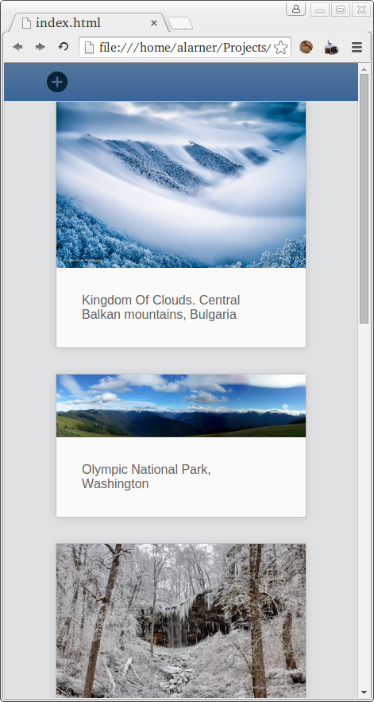

# Ember Data Image Board

## Description

Today we looked using Ember Data,

## Objectives

### Learning Objectives

After completing this assignment, you should be able to:

* Generate Ember Data Models
* Use `store.createRecord` to create new records
* Use `store.findAll` to locate all records
* Use `model.save` to save records

### Performance Objectives

After completing this assignment, you should be able to effectively use:

* Export ES2015 modules
* Use BEM class names and nested selectors for styling
* Use `fetch` to make requests to an API
* Create Ember CLI Projects
* Run Ember CLI Development Server `ember serve`
* Use Handlebars Application Template in Ember
* Create and use Route `model` hooks to load data
* Use controllers to manage data AFTER it has been loaded
* Use Ember Routes with Dynamic segments to load data for single resources from the server
* Use the `link-to` Handlebars component and the `transitionToRoute` method in controllers to navigate around your app
* Generate Ember Data Models
* Use `store.createRecord` to create new records
* Use `store.findAll` to locate all records
* Use `model.save` to save records

## Details

### Deliverables

* A new Ember project

### Requirements

Working in groups, create the following application

* User can create new images
  - Images have a `url` and `caption` property
* User can see all existing images




You may style using SASS or by using something like [`ember-bootstrap`](http://kaliber5.github.io/ember-bootstrap/)

For the API, use `https://image-board-api.herokuapp.com/images`

## Tasks

Work as a group to create your task list 😉

```md
```
