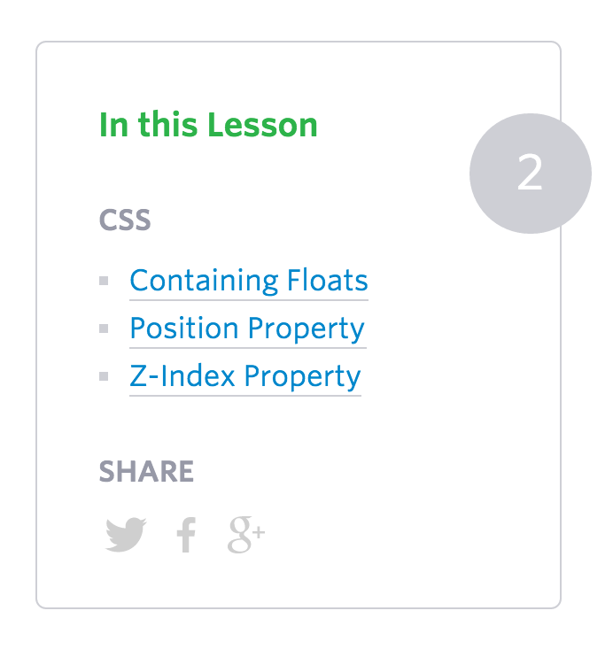

# Exercise - Positioning

## Description

This challenge will test your knowledge of CSS positioning

## Objectives

### Learning Objectives

This challenge will reinforce...

* Understanding how CSS positioning works.

### Performance Objectives

After completing this challenge, you will be able to effectively use

* `position: relative;`
* `position: absolute;`

## Details

In this challenge, you should be able to recreate the

### Deliverables

* A [code pen](codepen.io) with your HTML and CSS (note codepen's HTML is just the body content of your `index.html` file)

## Normal Mode

Recreate the following block using HTML and CSS



## Tasks

```
* [ ] [Sign up](https://codepen.io/signup/free) for a codepen free account
* [ ] [Create a new codepen](http://codepen.io/pen/)
* [ ] Checkpoint: Create the markup to represent the pictured site
  - [ ] Markup: "In This Lesson"
  - [ ] Markup: "CSS" List
  - [ ] Markup: "Share"
  - [ ] Markup: Number
* [ ] Checkpoint: Style the Layout of the site
  - [ ] Style Main box
  - [ ] Style "In This Lesson"
  - [ ] Style "CSS" List
  - [ ] Style "Share"
  - [ ] Style Number
* [ ] Save your Codepen
* [ ] Post link to your Codepen on online.theironyard.com
```

## Additional Resources

* http://learnlayout.com/
